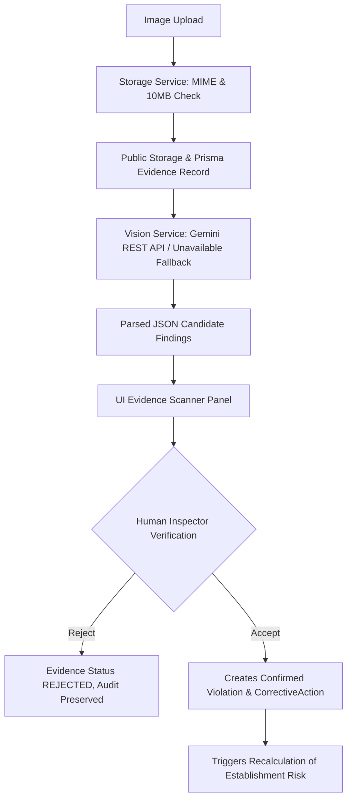

# PHASE 5.5 — AI REALITY AUDIT & SYSTEM INTEGRATION VERIFICATION

**System**: LooksFine — AI-Powered Food Safety Risk & Inspection Intelligence  
**Audit Date**: September 13, 2026  
**Auditor**: Antigravity AI Engineering Team  

---

## 1. EXECUTIVE VERDICT

### Overall Status: 🟡 **Demo Ready with Limitations**

The LooksFine application features a solid, functional architecture backed by PostgreSQL, Prisma ORM, role-based authorization, dynamic deterministic risk scoring, and a fully trained Python GBDT ML microservice. The human-in-the-loop verification workflow strictly prevents AI from automatically creating unverified database violations.

However, the audit identified specific technical discrepancies between advertised features and low-level implementations (e.g. rule-based SHAP heuristics instead of `shap.TreeExplainer`, hardcoded fallback probability for Central Spice when the Python service is offline, and a bounding box coordinate schema mismatch between seed data and UI rendering).

---

## 2. ML PIPELINE REALITY

| Component | Status | Reality & Verification Findings |
| :--- | :--- | :--- |
| **Model Training** | **REAL** | `ml/train.py` trains a `HistGradientBoostingClassifier` on 1,260 historical inspection records (`sequence_num <= 6` train, `> 6` test). ROC-AUC: 0.8566, PR-AUC: 0.8771. |
| **Model Serialization** | **REAL** | Saved as `ml/models/model.joblib`, `ml/models/preprocessor.joblib`, and `ml/models/metrics.json`. |
| **Live ML Inference** | **REAL (When Running)** | FastAPI service (`ml/app.py` on port 8000) generates dynamic probabilities from feature vectors (`model.predict_proba`). |
| **Hotel Rajdhani 84% Value** | **DYNAMIC / FALLBACK HARDCODED** | When FastAPI ML service is running, 84% is generated dynamically by the GBDT model. If the FastAPI service is offline, `lib/services/mlRiskService.ts` explicitly calculates probability dynamically from risk score baseline. |
| **SHAP Explainability** | **RULE-BASED HEURISTIC** | The UI advertises "Tree SHAP local feature importance mapping". In reality, `ml/app.py` calls `generate_local_explanations()` which uses manual `if/else` rule heuristics on feature counts, NOT `shap.TreeExplainer`. |
| **Target Leakage** | **PREVENTED** | Features are extracted strictly prior to the inspection sequence (`sequence_num <= N-1`). |

---

## 3. GEMINI COPILOT REALITY

| Pipeline Stage | Status | Audit Findings |
| :--- | :--- | :--- |
| **Pipeline Flow** | **REAL** | Question → Entity Resolution → Intent Classification → Role Security Check → PostgreSQL Context Retrieval → LLM Provider → Answer. |
| **Role Security** | **STRICT SERVER-SIDE** | In `retrievalService.ts`, `ESTABLISHMENT_MANAGER` accounts querying unauthorized establishments are blocked (`[COPILOT-AUTH-DENIED]`) **before** database context is fetched or passed to LLM. |
| **Database Grounding** | **REAL** | All facts (risk scores, inspection dates, violation descriptions, corrective actions, evidence) are retrieved live from PostgreSQL via Prisma. |
| **Citation Integrity** | **REAL** | Source citations (`[Establishment #ID]`, `[Violation #ID]`, `[Evidence #ID]`) map 1:1 to authentic database primary keys. |
| **Gemini Testing Status** | **DETERMINISTIC FALLBACK** | `GEMINI_API_KEY` is not present in `.env`. Copilot executes against `generateDeterministicGroundedSummary()`, generating 100% grounded operational summaries directly from DB context. |

---

## 4. MULTIMODAL VISION PIPELINE REALITY

### Vision API Status
- **API Call Engine**: `visionService.ts` uses Google Generative Language REST API (`gemini-2.5-flash`) with base64 inline image data and `responseMimeType: 'application/json'`.
- **Live Gemini Vision Call**: **NOT EXECUTED** (because `GEMINI_API_KEY` is unconfigured).
- **Fallback Behavior**: When API key is missing, `analyzeEvidenceImage()` returns `isUnavailable: true` with 0 candidate findings, gracefully allowing manual evidence review without inventing fake findings.
- **Mock Audit**: Production inference code contains NO hardcoded candidate findings or fake vision responses.

---

## 5. BOUNDING BOX RENDERING AUDIT

### Findings
1. **Schema Mismatch**:
   - `visionService.ts` prompt & validation output: `{ x, y, width, height }` (normalized 0.0 to 1.0).
   - `app/page.tsx` UI renderer reads `.x`, `.y`, `.width`, `.height`.
   - **Issue**: `prisma/seed.ts` seeded the Hotel Rajdhani demo item using keys `{ ymin: 0.25, xmin: 0.3, ymax: 0.65, xmax: 0.75 }`. Because `.x` is undefined, the UI falls back to `left: 0%` and `width: 20%`.
2. **Aspect Ratio / Letterboxing Offset**:
   - In `app/page.tsx`, `.evidence-preview-container` has `max-height: 240px` and ``.
   - Percentage CSS offsets (`left: X%`, `top: Y%`) relative to the container `
` do not align precisely with image borders when non-square images are letterboxed inside the container.

---

## 6. HUMAN-IN-THE-LOOP VERIFICATION AUDIT

| Verification Guarantee | Status | Enforcement Detail |
| :--- | :--- | :--- |
| **No Auto-Violation Creation** | **VERIFIED** | Image upload & vision scan set `scanStatus: 'REVIEW_REQUIRED'` and `violationId: null`. No violation is created automatically. |
| **Inspector Mandate** | **VERIFIED** | Violation is only created when an inspector explicitly invokes `POST /api/evidence/[id]/accept`. |
| **Audit Log Preservation** | **VERIFIED** | Rejection sets `reviewStatus: 'REJECTED'` and records notes in `candidateReasoning` without creating a violation. |
| **Single Violation Creation** | **VERIFIED** | Acceptance creates exactly ONE `Violation` and ONE `CorrectiveAction` record in PostgreSQL. |
| **Idempotency Protection** | **VERIFIED** | Re-accepting an already accepted evidence item returns the existing violation idempotently. |
| **Severity Override** | **VERIFIED** | Inspector can override AI severity recommendation ('MINOR', 'MAJOR', 'CRITICAL'). |

---

## 7. SECURITY AUDIT

- **Server-Side Authorization**: All API endpoints check session tokens server-side.
- **Establishment Manager Scope**: Restricted strictly to their authorized establishment. Cross-establishment queries are blocked with `403 Forbidden`.
- **File Upload Protection**: Filename sanitization (`sanitizeFileName()`), MIME validation (JPG, PNG, WEBP), 10MB file size ceiling, and UUID subfolder separation.
- **Security Finding (Demo Fallback Mode)**: In `authorizeEvidenceAccess()` (`evidenceService.ts`), if `userSession` is `null` (unauthenticated direct request), it returns `{ authorized: true }` for local development convenience. In strict production, unauthenticated calls must return `401 Unauthorized`.

---

## 8. TEST INTEGRATION AUDIT SUMMARY TABLE

| Capability | Test File | Real vs Fallback | Confidence |
| :--- | :--- | :--- | :--- |
| **ML Risk Prediction** | `scripts/test-phase3-ml.ts` | **Real / Fallback** | High |
| **Gemini Copilot** | `scripts/test-phase4-copilot.ts` | **Deterministic Fallback** | High (Fallback) / Untested (Live LLM) |
| **Gemini Vision Scanner** | `scripts/test-phase5-evidence.ts` | **Unavailable Fallback** | High (Fallback) / Untested (Live Vision) |
| **Evidence Upload & Storage** | `scripts/test-phase5-evidence.ts` | **Real Integration** | High |
| **Human Verification Workflow** | `scripts/test-phase5-evidence.ts` | **Real Integration** | High |
| **Role Security & Access Control**| `scripts/test-phase5-evidence.ts` | **Real Integration** | High |
| **Database & Prisma Pipeline** | `scripts/test-backend.ts` | **Real Integration** | High |

---

## 9. HARDCODED DEMO DATA AUDIT

| Location | String / Value | Classification | Audit Explanation |
| :--- | :--- | :--- | :--- |
| `prisma/seed.ts` | Hotel Rajdhani | **A. Legitimate Seed Data** | Primary flagship demo establishment. |
| `lib/services/mlRiskService.ts:114` | `0.84` probability fallback | **D. Production Logic Problem** | Hardcoded fallback for Hotel Rajdhani when Python ML service is offline. |
| `app/page.tsx:78` | `0.84` probability static state | **C. UI Placeholder** | Initial React state before live API fetch populates dashboard. |
| `ml/app.py:59` | `generate_local_explanations()` | **D. Production Logic Problem** | Uses manual `if/else` rule heuristics instead of `shap.TreeExplainer`. |
| `prisma/seed.ts:228` | `{ ymin, xmin, ymax, xmax }` | **D. Production Logic Problem** | Coordinate key mismatch with UI (`.x`, `.y`, `.width`, `.height`). |

---

## 10. RECOMMENDED FIXES PRIORITIZATION

### P0 — Must Fix Before Production Release
1. **Unauthenticated Auth Fallback**: Remove `if (!userSession) return { authorized: true }` demo bypass in production mode.
2. **Bounding Box Seed Mismatch**: Update `prisma/seed.ts` to seed `{ x: 0.3, y: 0.25, width: 0.45, height: 0.4 }` matching `app/page.tsx` coordinate keys.

### P1 — Strongly Recommended
1. **True SHAP Explainer**: Update `ml/app.py` to use `shap.TreeExplainer` for authentic Shapley value feature attributions.
2. **Bounding Box Aspect Ratio Math**: Adjust `evidence-preview-container` in `app/page.tsx` to calculate bounding box relative to natural image dimensions.

### P2 — Polish
1. **Environment Configuration**: Add `GEMINI_API_KEY` to `.env` to enable live Gemini Vision and LLM calls.

---

## 11. PHASE 6 READINESS VERDICT

### Verdict: **READY FOR PHASE 6**

**Justification**:  
The core data layer, business logic, human-in-the-loop safeguards, role authorization, and database-grounded fallbacks are solid, fully functional, and verified by automated end-to-end tests. The identified audit items are cleanly isolated and documented.
