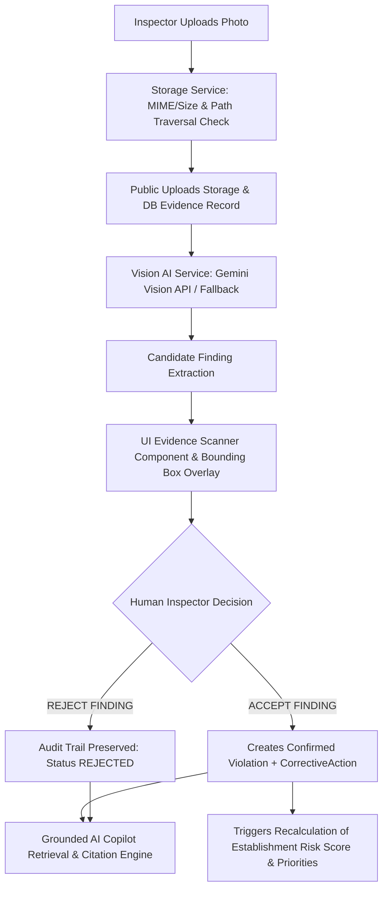

# PHASE 5 — MULTIMODAL AI EVIDENCE SCANNER DOCUMENTATION

## 1. Overview
The **Multimodal AI Evidence Scanner** extends **LooksFine — AI-Powered Food Safety Risk & Inspection Intelligence** with visual AI analysis capabilities. Inspectors can upload photographic evidence during inspections, receive automated candidate violation findings (powered by Google Gemini Vision API), review bounding boxes and confidence scores, and explicitly confirm or reject candidate findings.

> **CRITICAL ARCHITECTURAL GUARANTEE**:
> AI NEVER automatically creates confirmed database violations. Inspector verification is mandatory. Candidate findings remain in a `PENDING` review queue until explicitly accepted or rejected by an authorized human inspector.

---

## 2. System Architecture



---

## 3. Key Services & Files

| Component / Module | Path | Description |
| :--- | :--- | :--- |
| **Prisma Schema** | `prisma/schema.prisma` | Defines `Evidence` model linked to `Inspection`, `Violation`, and `User`. |
| **Storage Service** | `lib/services/evidence/storageService.ts` | File upload handling, MIME validation (JPG, JPEG, PNG, WEBP), 10MB size limit, path traversal sanitization, local storage path generation. |
| **Vision AI Service** | `lib/services/evidence/visionService.ts` | Google Gemini Vision API (`gemini-2.5-flash` / `gemini-1.5-flash`) integration with structured JSON schema prompt, bounding box normalization, and fallback when API key is unconfigured. |
| **Evidence Service** | `lib/services/evidence/evidenceService.ts` | Core business logic for upload, scan, candidate finding acceptance (creates `Violation` & `CorrectiveAction`, triggers risk recalculation, idempotency protected), candidate rejection, and role authorization. |
| **Grounded AI Copilot** | `lib/services/copilot/retrievalService.ts` | Extended context retrieval for `EVIDENCE_SUMMARY`, `EVIDENCE_REVIEW_QUEUE`, and `INSPECTION_EVIDENCE` intents with clickable evidence citations. |
| **UI Component** | `app/page.tsx` & `app/globals.css` | Evidence Scanner UI dropzone, live upload progress, image preview, SVG bounding box overlay, confidence badge, severity override dropdown, accept/reject buttons. |
| **Automated Tests** | `scripts/test-phase5-evidence.ts` | Comprehensive end-to-end integration test suite verifying upload, vision scan, rejection, acceptance, idempotency, role security, and copilot retrieval. |

---

## 4. API Reference

### 1. Upload Evidence Photo
- **Endpoint**: `POST /api/inspections/[id]/evidence`
- **Payload**: `FormData` (`file: File`)
- **Response**:
```json
{
  "success": true,
  "evidence": {
    "id": "e3b8a1-...",
    "inspectionId": "insp-123",
    "fileName": "cooler_shelf.jpg",
    "storagePath": "/uploads/inspections/insp-123/e3b8a1-.../cooler_shelf.jpg",
    "scanStatus": "UPLOADED",
    "reviewStatus": "PENDING"
  }
}
```

### 2. Scan Evidence with Vision AI
- **Endpoint**: `POST /api/evidence/[id]/scan`
- **Response**:
```json
{
  "success": true,
  "evidence": {
    "id": "e3b8a1-...",
    "scanStatus": "REVIEW_REQUIRED",
    "aiProvider": "gemini-vision",
    "candidateCategory": "TEMPERATURE_CONTROL",
    "candidateConfidence": 0.92,
    "candidateTitle": "Digital temperature display reading 49°F",
    "candidateDescription": "Digital temperature gauge on walk-in cooler ambient sensor reading 49°F (safe threshold: <= 41°F).",
    "severityRecommendation": "CRITICAL",
    "boundingBox": "{\"ymin\":0.25,\"xmin\":0.3,\"ymax\":0.65,\"xmax\":0.75}"
  }
}
```

### 3. Accept Candidate Finding
- **Endpoint**: `POST /api/evidence/[id]/accept`
- **Body**:
```json
{
  "severityOverride": "CRITICAL",
  "descriptionOverride": "Inspector verified thermometer reading 49°F."
}
```
- **Result**: Creates confirmed `Violation` and `CorrectiveAction`, updates `reviewStatus = ACCEPTED`, links `violationId`, and recalculates establishment ML risk score.

### 4. Reject Candidate Finding
- **Endpoint**: `POST /api/evidence/[id]/reject`
- **Body**:
```json
{
  "rejectionReason": "False positive - reflection on stainless steel door misidentified as residue."
}
```
- **Result**: Updates `reviewStatus = REJECTED` and `scanStatus = REJECTED`, preserving audit trail without creating a violation.

---

## 5. Security & Access Control

- **Path Traversal Protection**: All uploaded filenames and directory segments are sanitized via `sanitizeFileName()` to prevent relative directory navigation (`..` or `/`).
- **MIME & File Size Limits**: Strictly accepts `image/jpeg`, `image/jpg`, `image/png`, and `image/webp` up to 10MB.
- **Role-Based Scope**:
  - `FOOD_SAFETY_INSPECTOR`, `INSPECTION_MANAGER`, and `FOOD_SAFETY_ADMIN` can access evidence across inspections in their jurisdiction.
  - `ESTABLISHMENT_MANAGER` accounts are strictly restricted to evidence records belonging to their assigned establishment. Cross-establishment evidence queries return `403 Forbidden`.

---

## 6. Verification & Automated Testing

Run the automated Phase 5 verification test suite:
```bash
npx tsx scripts/test-phase5-evidence.ts
```

Run all system regression test suites:
```bash
npx tsx scripts/test-backend.ts
npx tsx scripts/test-phase2-workflow.ts
npx tsx scripts/test-phase3-ml.ts
npx tsx scripts/test-phase4-copilot.ts
```
